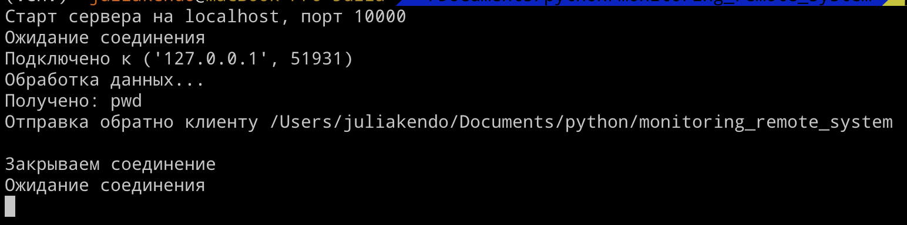
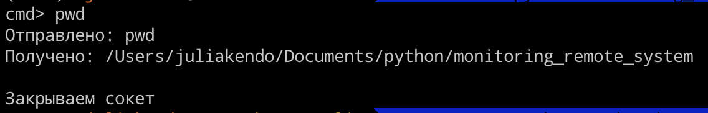
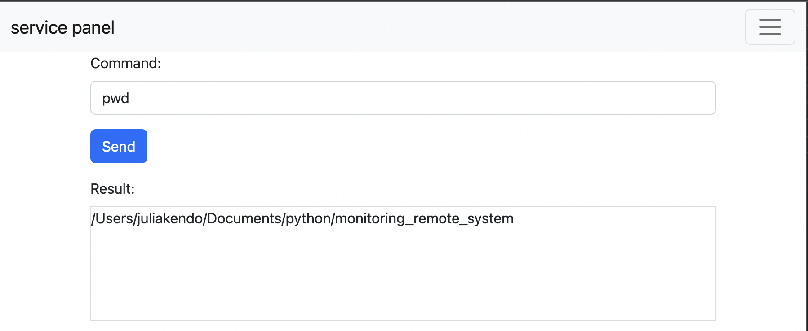

# Скрипт выполнения shell комманд на удаленном компьютере

Скрипт предназначен для выполнения комманды на удаленной машине. Состоит из двух частей. Сервер, запускается на удаленной машине и находится в режиме ожидания подключения. Клиент, выполняется на локальной машине и отправляет введенную пользователем команду на сервер для выполнения, а так же принимает и выводит результат выполнения комманды сервером. Так же скрипт может работать с использованием вебсокетов и оснащен веб интерфейсом, в котором можно вводить комманды и получать их результат.

 |   |  

# Содержание

- [Установка](#установка)
  - [Переменные окружения](#установите-переменные-окружения)
- [Процедура запуска](#процедура-запуска)
  - [Запуск сервера](#запуск-сервера)
  - [Запуск клиента](#запуск-клиента)
  - [Запуск скрипта для мониторинга](#запуск-скрипта-для-мониторинга)  
- [Процедура завершения работы сервера](#процедура-завершения-работы-сервера)


# Установка

Клонируйте репозиторий, и создайте виртуальное окружение. После этого установите зависимости:

```
$ python3 -m venv env
$ . env/bin/activate
(env) $ pip install -r requirements.txt
```

В каталоге `examples` собраны примеры скриптов для мониторинга конкретных показателей удаленной машины.

## Установите переменные окружения

`TG_LOG_TOKEN` - токен телеграмм бота для сбора логов.

`TG_CHAT_ID` - чат id пользователя телеграмм для сбора логов.


# Процедура запуска


## Запуск сервера:

Подключение через сокеты:
```bash
$ python serv.py --host 127.0.0.1 --port 8000
```

Подключение через вебсокеты:
```bash
$ python ws_serv.py --host 127.0.0.1 --port 8000
```

Параметры запуска сервера:
`--host` - ip адрес хоста на котором запускается сервер. По умолчанию localhost.
`--port` - порт сервера на который будет стучаться клиент. По умолчанию 10000.


## Запуск клиента:

Подключение через сокеты:
```bash
$ python client.py --host 127.0.0.1 --port 8000
```

Подключение через вебсокеты:
```bash
$ python ws_client.py --host 127.0.0.1 --port 8000 --encoding windows-1251
```

Параметры запуска клиента:
`--host` - ip адрес хоста на котором запущен сервер. По умолчанию localhost.
`--port` - порт на котором запущен сервер. По умолчанию 10000.
`--encoding` - кодировка на клиенте. По умолчанию utf-8.


## Запуск скрипта для мониторинга:

1. Настраиваем параметры отправки по электронной почте. Создаем файл `mailing.ini`, следующего содержания:

```

  [smtp]
  server = адрес smtp сервера
  from_addr = адрес электронной почты для отправки

  [auth]
  username = имя пользователя электронной почты
  password = пароль пользователя

```

2. Настраиваем параметры мониторинга. Создаем файл `config.ini`, следующего содержания:

```

  [mail]
  subject = тема электронного письма
  mailto = адрес отправки электронных писем

  [schedule]
  waiting_time = частота выполнения комманд мониторинга в секундах

  [common]
  commands = Список комманд ОС, через запятую

```

3. Запуск скрипта:

```bash
$ python main.py --host 127.0.0.1 --port 8000
```

Параметры запуска клиента:
`--host` - ip адрес хоста на котором запущен сервер. По умолчанию localhost.
`--port` - порт на котором запущен сервер. По умолчанию 10000.


# Процедура завершения работы сервера

На клиенте введите команду `exit`, сервер завершит работу.
